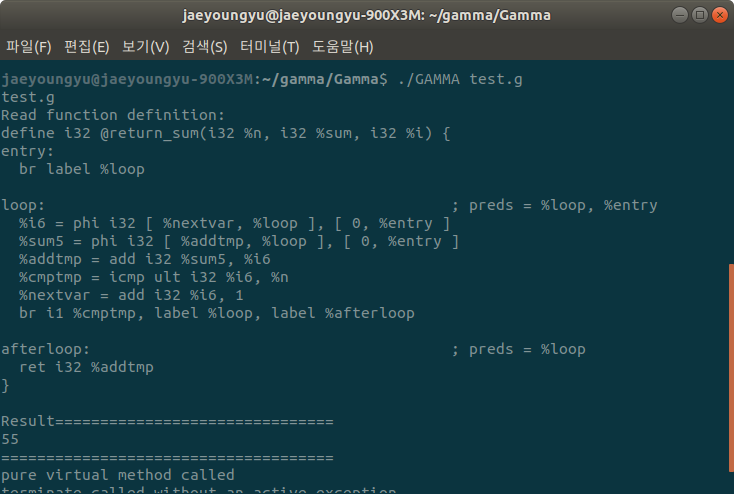

# Gamma

### 명령어
<code>
g++ `llvm-config --cxxflags --ldflags --system-libs --libs core` Gamma.cpp lexer.cpp  LLparser.cpp $CLANG_LIBS `llvm-config --libs --system-libs` -o GAMMA
</code>

### 사용 패턴
팩토리 패턴
### 개발 환경
Linux 
### 라이브러리
LLVM

# 실행 화면 

